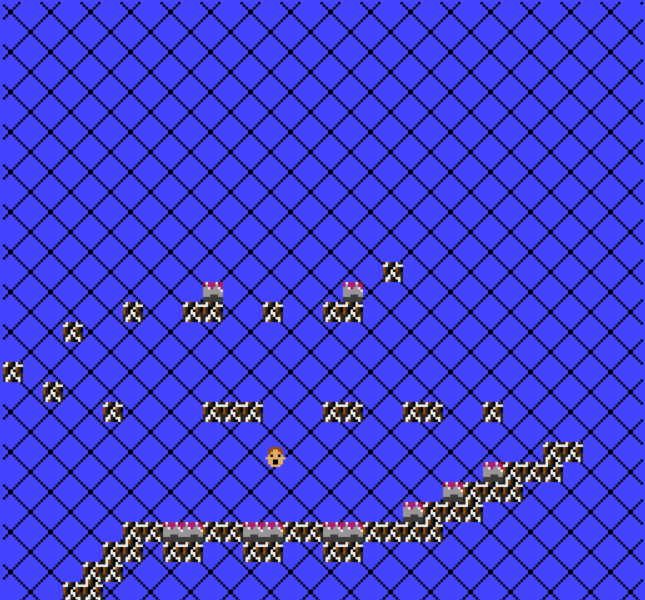

# Adventure Climber

Author: Ben Cagan, George Whitfield, Woody McCoy

Design: Traverse a dangerous mountain, avoiding the spikes and falls along the way!

Screen Shot:

How Your Asset Pipeline Works:

Firstly, we load in tiles from PNG images, and add them to the PPU. Then, we assembly the background procedurally, and generate the level by reading a layout from a png.

How To Play:

Arrow keys to move left and right, space to jump! Try to get as high as you can without dying to the spikes.

Sources: (TODO: list a source URL for any assets you did not create yourself. Make sure you have a license for the asset.)

This game was built with [NEST](NEST.md).

